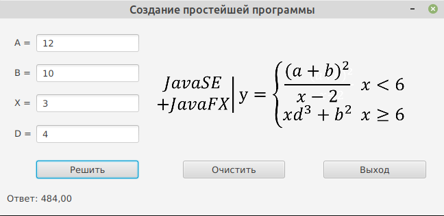

# TSN_Idea_JavaFX_Calc
Пример визуального приложения на JavaFX11 для IntelliJ IDEA на Java



```
java -jar --module-path /opt/javafx-sdk-11.0.2/lib --add-modules javafx.controls,javafx.fxml ./out/artifacts/JavaFxApplication_jar/JavaFxApplication.jar
```

Main.java
```
package sample;

import javafx.application.Application;
import javafx.fxml.FXMLLoader;
import javafx.scene.Parent;
import javafx.scene.Scene;
import javafx.scene.image.Image;
import javafx.stage.Stage;

public class Main extends Application {

    @Override
    public void start(Stage primaryStage) throws Exception {
        Parent root = FXMLLoader.load(getClass().getResource("sample.fxml"));
        primaryStage.setScene(new Scene(root));
        primaryStage.getIcons().add(new Image("/image/icon.jpg"));
        primaryStage.setResizable(false);
        primaryStage.setTitle("Создание простейшей программы");
        primaryStage.show();
    }

    public static void main(String[] args) {
        launch(args);
    }
}
```

Controller.java
```
package sample;

import javafx.fxml.FXML;
import javafx.fxml.Initializable;
import javafx.scene.control.Label;
import javafx.scene.control.TextField;

import javax.swing.*;
import java.awt.*;
import java.net.URL;
import java.util.ResourceBundle;

public class Controller implements Initializable {

    @FXML
    private Label label_answer;
    @FXML
    private TextField textField_A;
    @FXML
    private TextField textField_B;
    @FXML
    private TextField textField_X;
    @FXML
    private TextField textField_D;

    @Override
    public void initialize(URL url, ResourceBundle rb) {
    }

    @FXML
    private void buttonMathAction() {
        double a, b, x, d, y;
        try {
            a = Double.parseDouble(textField_A.getText());
            b = Double.parseDouble(textField_B.getText());
            x = Double.parseDouble(textField_X.getText());
            d = Double.parseDouble(textField_D.getText());
        } catch (Exception ex) {
            Toolkit.getDefaultToolkit().beep();
            JOptionPane.showMessageDialog(null, "Ошибка введенных данных!",
                "Ошибка ввода", JOptionPane.ERROR_MESSAGE);
            textField_A.requestFocus();
            label_answer.setText("В введенных значениях допущены ошибки");
            textField_A.setText("");
            textField_B.setText("");
            textField_X.setText("");
            textField_D.setText("");
            return;
        }
        if (x < 6) {
            y = (((a + b) * (a + b)) / (x - 2));
        } else {
            y = ((x * (d * d * d)) + (b * b));
        }
        if (!(Double.isNaN(y)) && (!Double.isInfinite(y))) {
            label_answer.setText("Ответ: " + String.format("%.2f", y));
        } else {
            label_answer.setText("Нет ответа");
        }
    }

    @FXML
    private void buttonClearAction() {
        label_answer.setText("Ответ: ");
        textField_A.setText("");
        textField_B.setText("");
        textField_X.setText("");
        textField_D.setText("");
    }

    @FXML
    private void buttonExitAction() {
        System.exit(0);
    }

}
```

sample.fxml
```
<?xml version="1.0" encoding="UTF-8"?>

<?import javafx.scene.control.Button?>
<?import javafx.scene.control.Label?>
<?import javafx.scene.control.TextField?>
<?import javafx.scene.image.Image?>
<?import javafx.scene.image.ImageView?>
<?import javafx.scene.layout.AnchorPane?>

<AnchorPane id="AnchorPane" prefHeight="288.0" prefWidth="650.0" xmlns="http://javafx.com/javafx/11.0.1"
            xmlns:fx="http://javafx.com/fxml/1" fx:controller="sample.Controller">
    <children>
        <Button fx:id="button_Math" layoutX="54.0" layoutY="208.0" mnemonicParsing="false" onAction="#buttonMathAction"
                prefHeight="26.0" prefWidth="149.0" text="Решить"/>
        <Button fx:id="button_Clear" layoutX="268.0" layoutY="208.0" mnemonicParsing="false"
                onAction="#buttonClearAction" prefHeight="26.0" prefWidth="149.0" text="Очистить"/>
        <Button fx:id="button_Exit" layoutX="473.0" layoutY="208.0" mnemonicParsing="false" onAction="#buttonExitAction"
                prefHeight="26.0" prefWidth="150.0" text="Выход"/>
        <Label fx:id="label_a" layoutX="22.0" layoutY="27.0" text="A ="/>
        <Label fx:id="label_b" layoutX="22.0" layoutY="71.0" text="B ="/>
        <Label fx:id="label_x" layoutX="22.0" layoutY="115.0" text="X ="/>
        <Label fx:id="label_answer" layoutX="11.0" layoutY="254.0" prefHeight="18.0" prefWidth="614.0" text="Ответ:"/>
        <TextField fx:id="textField_A" layoutX="54.0" layoutY="23.0" prefHeight="26.0" prefWidth="150.0"/>
        <TextField fx:id="textField_B" layoutX="54.0" layoutY="67.0" prefHeight="26.0" prefWidth="150.0"/>
        <TextField fx:id="textField_X" layoutX="54.0" layoutY="111.0" prefHeight="26.0" prefWidth="150.0"/>
        <Label fx:id="label_d" layoutX="22.0" layoutY="160.0" text="D ="/>
        <TextField fx:id="textField_D" layoutX="54.0" layoutY="156.0" prefHeight="26.0" prefWidth="150.0"/>
        <ImageView fitHeight="134.0" fitWidth="387.0" layoutX="224.0" layoutY="49.0" pickOnBounds="true"
                   preserveRatio="true">
            <image>
                <Image url="@../image/formula.png"/>
            </image>
        </ImageView>
    </children>
</AnchorPane>
```